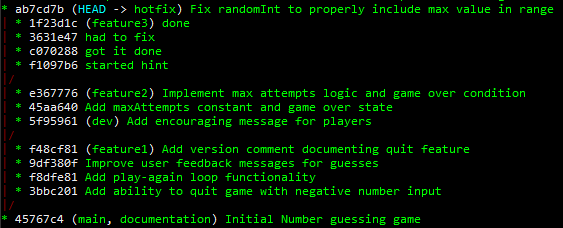

# Task 2

**Author:** Stephen Lee, ASU SER316 team
**ASURITE:** srlee16
**Date:** 20 Oct 2025

## Step 1
Task 2 was made up of 6 branches (to include main). With the exception of the feature2 branch, all other branches stemmed directly from the main branch.
The feature2 branch stemmed from the dev branch. Below is a breif depiction of the the branches and their respective commits. Please also see **figure 1**.

- **main**	
	- **Commit 1:** Initial Number guessing game
- **feature1**	
	- **Branch:** main - Initial Number guessing game
	- **Commit 1:** Add ability to quit game with negative number input
	- **Commit 2:** Add play-again loop functionality
	- **Commit 3:** Improve user feedback messages for guess
	- **Commit 4:** Add version comment documenting quit feature
- dev 
	- **Branch:** main - Initial Number guessing game
	- **Commit 1:** Add encouraging message for players
- feature2
	- **Branch:** main - Initial Number guessing game
	- **Branch:** dev - Add encouraging message for players
	- **Commit 1:** Add maxAttempts constant and game over state
	- **Commit 2:** Implement max attempts logic and game over condition
- feature3
	- **Branch:** main - Initial Number guessing game
	- **Commit 1:** started hint
	- **Commit 2:** got it done
	- **Commit 3:** had to fix
	- **Commit 4:** done
- hotfix
	- **Branch:** main - Initial Number guessing game
	- **Commit 1:** Fix randomInt to properly include max value in range

***Figure 1.** Task 2 original branch structure*

## Step 8

Task 2 had us integrate branches feature1, feature2, and feature3 into the dev branch. Feature1 and feature3 were direct branches of main  
while feature2 was a branched from dev. Features 1 and 2 both had meaningful commit comments while feature3 had many poor commit comments.

To integrate these branched we used merge, rebase, squash, and cherry-pick. Merge combines changes amongst branches while maintining each branches individual history,
this is good for teams settings where it's important to keep a projects full commit history. Rebase combines changes amongst branches but rewrites a branches commit history,
this is good for personal or private projects when a linear history is preffered. Squash is used to combine individual commits rather than whole branches, 
this is helpful when trying to clean and consolidate a branches commit history. Cherry-pick allows us to apply a specific commits to to a branch.
